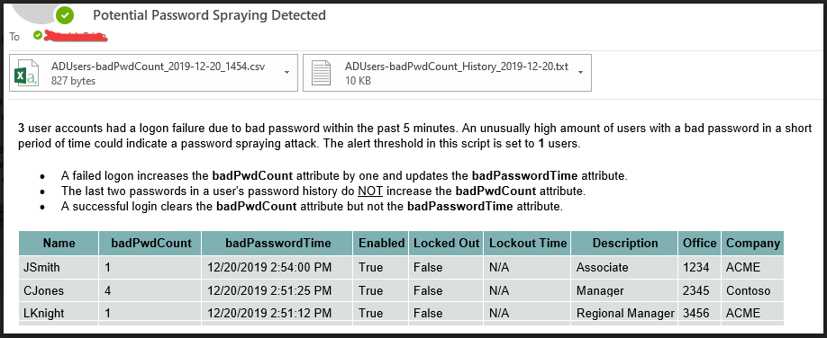

# DetectPasswordSpray
A script to detect a potential password spraying attack using AD attributes, log the results and send an email alert if a threshold is crossed.

# Background:

Password spraying is the act of taking what would be considered a common password (P@ssw0rd!) and testing it against multiple accounts. Then you repeat this process with a second common password and so on. If you do this enough times against enough users, there is a decent likelihood that at least one of the users will be using one of those common passwords.
 
Password spraying is traditionally detected by correlating event logs. You send your domain controller security logs to a central location like a SIEM and then it attempts to detect unusual patterns. At a minimum, setting up this type of solution yourself requires some advanced knowledge, hardware resources and a decent amount of time to configure it. Commercial products and/or managed services will get you over some of those hurdles, but the best ones can be very expensive. 
 
This script is not meant as a replacement for event log correlation but instead offers an alternative method. The connection of the badPwdCount and badPasswordTime AD attributes to password spraying is not new information and is often mentioned in blog posts on the subject. However, they tend to be mentioned as an explanation of how you get caught by locking out accounts. I did some searches and didn't see an examples of anyone specifically using those atributes as a method to detect potential password spraying so I decided to create this script.

# Why it works:

A failed login due to a bad password is logged as an event in the security log. But all bad password failures are not necessarily equal. For example, a user not updating thier previous password on a mobile device will flood the security logs with failed logins but do we really care about those failures? We obviously care but only because the user will not be able to get email until the password is updated. It may be useful to generate an alert to the helpdesk based on the sheer volume of failed logins but there is likely no security concern.

An interesting aspect of a bad password failure due to using the previous password is the badPwdCount attribute on the AD user account is not increased. Actually, using either of the previous TWO passwords will not increase the badPwdCount attribute. As a result, these failures will not contribute to an account lockout. A user could have thousands of this type of bad password failure in a single day and never be locked out. There is a little more involved but that is a high level explanation. See this article for more detailed info: https://social.technet.microsoft.com/wiki/contents/articles/32490.active-directory-bad-passwords-and-account-lockout.aspx

What happens when a user (or attacker) enters an incorrect password that is not one of their previous two passwords? The badPwdCount attribute increases to '1' and the badPasswordTime attribute is updated with the time of the failure. The next incorrect password will increase it to '2' and update badPasswordTime again. When the user successfully enters their current password, the badPwdCount attribute is set back to '0' (badPasswordTime remains unchanged). However, if the domain lockout threshold is set to '3' and the user continues to enter incorrect passwords, the next attempt will lock the account. What happens after that depends on the password policy over your domain.

An attacker never wants to lock the account as that would attract unwanted scrutiny. Even an admin with no monitoring in place would dig deeper if a VIP continously got locked out and might connect the dots for a group of AD accounts being locked out at the exact same time. To avoid lockouts, an attacker will try one or two passwords against a number of accounts and then wait for the badPwdCount to reset before trying again. If they are careful and patient, this could potentially go on forever without detection.

# How it works:

The badPwdCount attribute gives us a way to determine a high number of login failures across multiple user accounts due to a bad password while excluding the many users not updating their old password on a device. A large domain could have tens or even hundreds of thousands of bad password attempts every day, with the overwhelming majority likely due to users changing their password but not updating their previous password on devices. 

A user could have a forgotten iPad sitting at home that occasioannly wakes up to check for new email. They change their password and 90 days later are forced to change their password again. Their account won't start locking out until they change their password a third time. But for those preceding 180 days, there will be a steady stream of logon failures. There could easily be dozens of users in that sceanrio at all times, filling your event logs.

Event log correlation would need to dig through all of these events in addition to the actual incorrect password attempts that could indicate password guessing. For example, in a five minute window, there might be 2,000 bad passwords but only 50 are truly incorrect passwords that increase the badPwdCount attribute. Out of those 50, maybe 30 of those users immediately followed the logon failure with a successful logon, resetting their badPwdCount back to zero, leaving us with 20. A SIEM will need to look at all 2,000 failures and try to detect a pattern but we will only look at 20.

If your defined threshold is crossed, an email alert will be sent. A CSV file of the data contained in the email body will be attached as well as a log of that day's counts for reference. In the example below, the threshold was lowered to '1' but, based on the values of the badPasswordTime attributes, this would likely not indicate password spraying. We would expect the times to be within a few seconds of each other.

So, for the purpose of this script, we only care about bad password attempts that increase the badPwdCount attribute. In addition, we only care if those users have a value in the badPasswordTime attribute in the past X minutes. And we don't care about the badPasswordTime attribute by itself. If a user has a recent time in badPasswordTime but no current vaue in badPwdCount, it was likely an innocent mistake and they have since logged in successfully.

# Tuning the script:

There could be a number of users that have a bad password count at any given time and that by itself is not a reason for concern. Users will occasionally enter an incorrect password which increases the badPwdCount attribute and then quickly reset it to '0' by successfully logging in. 

In addition to logging the users with a current bad password count, the script writes a second log file, rotating daily, of how many users were found. I would suggest setting the intial threshold to a high number like '100' and letting it run for a few days or weeks to get an idea of how many users it returns on average as well as find the highest number. I would also suggest not configuring the SMTP variables yet to ensure we don't generate any alerts while gathering stats. 

Next we need to decide how low we can set the alert threshold so we don't get false alarms. For a small company, this script will likely return '0' or ‘1’ users most of the time and maybe '2' users on rare occasions. In that scenario, you might set the alert threshold from '3' to '5'. If the alert emails only go to a lone admin, you might want to be aggressive and set it to '3', knowing there will likely be an occasional false alarm.

Large companies might give themselves more of a buffer because it can be a bigger deal to send out an alert email to potentially dozens of users across multiple teams. For example, if you routinely have 30 users returned by this script, you could imagine scenarios like a Monday morning where it could temporarily climb to 40+ without indicting an actual problem. However, if you set the threshold to '50', you could easily miss a smaller password spraying attempt targeting only 20-30 users.

Before setting the threshold, I would suggest configuring the SMTP variables and then setting the threshold to '1' to verify it is working properly. If the company is small, you might need to intentionally fail a logon from your account to increase your badPwdCount attribute. Check the log files to verify they contain data. Did you add the server running the script to your SMTP relay?

There is no perfect threshold so it depends on your priority of potential false alarms vs. potentially missing a problem. 

The possibility of an occasional false alarm is why I added some additional AD attributes to the report like office and company. Maybe you acquired a new company and their HQ site came onboard today which would explain significantly more bad passwords. I would tweak the email with any attributes that are meaningful to your organization.

You may wish to schedule two copies of the script with different thresholds. Let’s say you average '10' users in the report during business hours but only '1' or '2' after hours. If you set the threshold to '20', you could miss small password spraying attacks overnight. An option would be to have two copies of the script. Maybe you schedule one from 7AM to 6PM M-F with a threshold of '15' or '20' and schedule the other from 6PM to 7AM M-F and weekends with a threshold of '5'.

# Caveats

Will this script always detect a password spraying attempt? Of course not. Nothing is foolproof, including an expensive SIEM product. This detection method could be avoided by an attacker trying a very low number of user accounts, only during business hours and spreading them out a few minutes apart at random intervals.

Setting a threshold becomes much more difficult at a larger company, especially if you have a culture that has zero tolerance for an occasional false alarm (and we obviously all hate false alarms). For example, if the quantity of users with a current value in badPwdCount jumps from 3 to 8 to 16 to 2 to 6, etc. in each 5-minute check and your threshold is set to 20, you could easily miss a small password spraying attack against only your C-level employees.

# Response

You just got an alert email that 100 users have a badPwdCount of at least '1' within the past five minutes. The email body and CSV file show most or all of the badPasswordTime attributes are within a few seconds of each other. Unless you have some automated process that is failing, that is almost certainly password spraying.

Now what? I can point you in the right direction but this is well beyond the scope of this script. Every domain is different regarding audit settings, GPOs, event log sizes, commercial tools, custom in-house scripts/apps, etc. 

Assuming it even caught the attack, a managed service might send you a pretty report that there was a password spraying attack on 10/13/2019 from 10:25:34-10:25:36, the source IP is 10.1.12.13, the source country is Ukraine and no accounts were compromised. However, without such a tool, we need to figure all of this out by ourselves.

Based on badPasswordTime, you need to find the events in the security log to get the source. Did the failed logons all come from the same source? Did they come from a public web site like OWA? Did they come from ADFS? Did they come an RDP server exposed to the internet? Or worse, did they come from an internal source?

My advice is to think about what you can do to gather this info before an incident happens. Take a look at one of the 'good' CSV files with only a few entries. Can you find those events on the PDC Emulator to get the source? If the threshold is tripped at 10PM on Friday, is your security log size large enough that the events will still be there Monday morning? If the source is an ADFS or Exchange server, do you have auditing enabled on those servers and the event log sized properly?

The most efficient solution is to proactively collect the logs using an event log collector or a low-cost commercial product like ADAudit Plus. The logs will be there waiting for you and they will be searchable. Another benefit is being able to quickly search for any successful logons at the exact same time from the same source(s), indicating an account was potentially compromised.

